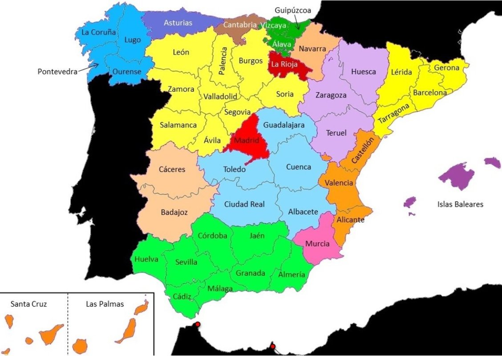

# Matrícules Provincials Numèriques (1900-1971), Alfanumèriques (1971-2000) i Estatals des de 2000

⚠️ AVÍS D'EXEMPCIÓ DE RESPONSABILITAT

> Aquesta aplicació NO representa cap entitat pública, ni té cap vinculació oficial amb la Direcció General de Trànsit (DGT), el Ministeri de l'Interior o qualsevol organisme governamental d'Espanya.
> *   L'aplicació és una eina independent de caràcter informatiu i divulgatiu.
> *   Encara que la informació es basa en dades públiques oficials, l'aplicació no ofereix serveis de verificació de vehicles en temps real ni tràmits administratius oficials.

Aquesta aplicació ofereix una referència completa del sistema provincial numèric de matriculació de vehicles utilitzat a Espanya entre l'octubre de 1900 i l'octubre de 1971. El sistema es compon d'una, dues o tres lletres que representen la província, seguides de fins a sis números.

---

### ➤ Nota sobre l'exactitud de les dates

> En el cas de ser la matrícula número 1, la data que es mostra és exacta. Per a la resta de casos, la data és una **aproximació** calculada sota la suposició d'una matriculació homogènia dins de l'any natural (utilitzant una base de 360 dies). Pot haver-hi diferències superiors a un any, especialment quan el nombre de matriculacions és baix i, sobretot, en matriculacions anteriors a 1926.

---

### ➤ Llista de Províncies i Sigles

Aquí es mostra la llista completa de províncies amb les seves sigles corresponents. Algunes províncies van tenir canvis de sigles al llarg del temps.

| Codi | Sigles | Província | Codi | Sigles | Província |
| :--- | :--- | :--- | :--- | :--- | :--- |
| 01 | **VI** | Àlaba | 27 | **LU** | Lugo |
| 02 | **ALB / AB** | Albacete | 28 | **M** | Madrid |
| 03 | **A** | Alacant | 29 | **MA** | Màlaga |
| 04 | **AL** | Almeria | 30 | **MU** | Múrcia |
| 05 | **AV** | Àvila | 31 | **PA / NA** | Navarra |
| 06 | **BA** | Badajoz | 32 | **OR / OU** | Ourense |
| 07 | **BA / PM / IB** | Illes Balears | 33 | **O** | Astúries (Oviedo) |
| 08 | **B** | Barcelona | 34 | **P** | Palència |
| 09 | **BU** | Burgos | 35 | **TE / GC** | Las Palmas |
| 10 | **CAC / CC** | Càceres | 36 | **PO** | Pontevedra |
| 11 | **CA** | Cadis | 37 | **SA** | Salamanca |
| 12 | **CAS / CS** | Castelló | 38 | **TE / TF** | Santa Cruz de Tenerife |
| 13 | **CR** | Ciudad Real | 39 | **S** | Cantàbria (Santander) |
| 14 | **CO** | Còrdova | 40 | **SEG / SG** | Segòvia |
| 15 | **C** | La Corunya | 41 | **SE** | Sevilla |
| 16 | **CU** | Conca | 42 | **SO** | Sòria |
| 17 | **GE / GI** | Girona | 43 | **T** | Tarragona |
| 18 | **GR** | Granada | 44 | **TER / TE** | Terol |
| 19 | **GU** | Guadalajara | 45 | **TO** | Toledo |
| 20 | **SS** | Guipúscoa | 46 | **V** | València |
| 21 | **H** | Huelva | 47 | **VA** | Valladolid |
| 22 | **HU** | Osca | 48 | **BI** | Biscaia |
| 23 | **J** | Jaén | 49 | **ZA** | Zamora |
| 24 | **LE** | Lleó | 50 | **Z** | Saragossa |
| 25 | **L** | Lleida | 51 | **CE** | Ceuta |
| 26 | **LO / LR** | La Rioja (Logronyo) | 52 | **ML** | Melilla |

**Territoris Històrics:**

| Codi | Sigles | Territori |
| :--- | :--- | :--- |
| 53 | **ME / SHA / SH** | Sàhara Espanyol |
| 54 | **ME / I / IF** | Ifni |
| 55 | **TEG / FP** | Fernando Poo |
| 56 | **TEG / RM** | Río Muni |

---

### ➤ Notes Històriques sobre Canvis de Sigles

1.  **Normalització (1907):** Les sigles provincials es van fer oficials per Reial Ordre del 24/05/1907. Tot i que el reglament de 1900 ja obligava a un registre, no va ser fins al 1907 que es va establir un criteri uniforme.
2.  **Navarra (1918):** Canvi de **PA** a **NA** por RD de 23/07/1918.
3.  **Càceres (1918):** Canvi de **CAC** a **CC** por RD de 23/07/1918.
4.  **Illes Balears (1918-1926):** Es va canviar de **PM** a **BA** el 1918, però no es va aplicar per la confusió amb Badajoz (BA). El 1926 es va tornar a **PM**. Més tard, el 1997, va canviar a **IB**.
5.  **Albacete (1926):** Canvi de **ALB** a **AB** por RD de 16/06/1926.
6.  **Castelló (1926):** Canvi de **CAS** a **CS** por RD de 16/06/1926.
7.  **Segòvia (1926):** Canvi de **SEG** a **SG** por RD de 16/06/1926.
8.  **Terol (1926):** Canvi de **TER** a **TE** por RD de 16/06/1926.
9.  **Ceuta i Melilla (1926):** Es van assignar les sigles **CE** i **ML** respectivament, tot i que ja s'utilitzaven des de 1922 i 1917.
10. **Canàries (1927):** La província de Canàries (TE) es va dividir en **Las Palmas (GC)** i **Santa Cruz de Tenerife (TF)**.
11. **Girona (1992):** Canvi de **GE** a **GI** por RD de 29/05/1992.
12. **Ourense (1998):** Canvi de **OR** a **OU** por RD de 31/07/1998.
13. **La Rioja (2000):** Es va aprovar el canvi de **LO** a **LR**, però amb l'eliminació de les sigles provincials en el nou sistema, aquest canvi mai es va fer efectiu en la pràctica.

---

### ➤ Més Informació i Contacte

*   **Butlletí Oficial de l'Estat (BOE):** Reial Decret de 17 de setembre de 1900 (Reglament per al Servei de Cotxes Automòbils) i posteriors modificacions fins a l'Ordre de 21 de setembre de 1971: [https://www.boe.es](https://www.boe.es)
*   **Direcció General de Trànsit (DGT):** Històric de matrícules i llistat de sigles de províncies: [https://www.dgt.es](https://www.dgt.es)
*   **CRW Flags:** Spain: Historical flags: [https://www.crwflags.com/fotw/flags/es_his.html](https://www.crwflags.com/fotw/flags/es_his.html)
*   **Web:** [prosselloe.wordpress.com](http://prosselloe.wordpress.com)
*   **Correu electrònic:** [prosselloe@gmail.com](mailto:prosselloe@gmail.com)

© prosselloe 2019-2026

## Crèdits
